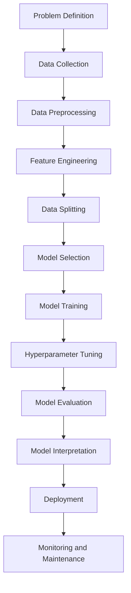
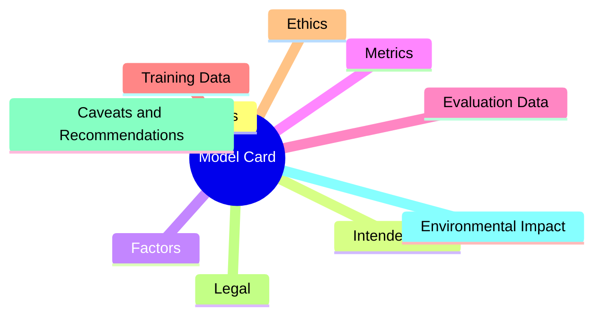

# How to document an AI/Machine Learning Model


| Author         | Created    | Updated    | Status    |
| -------------- | ---------- | ---------- | --------- |
| Raphaël MANSUY | 03/09/2023 | 03/09/2023 | Published |


## Improving Transparency in AI through Model Cards

Machine learning and AI models are being rapidly developed and deployed across many areas of society, including healthcare, finance, and education.

However, these models can perpetuate biases, cause unintended harm, or be misused if created without care.

It is important for companies and organizations to be transparent about how they train and implement these models.

Recently, there has been a push for greater transparency and accountability in the AI industry, with companies such as OpenAI releasing model cards that provide information on a model's strengths, limitations, copyrights source and requirements for ethical use.

What is a model card? A model card is a technical document that contains important information for safely and effectively deploying models.

This type of documentation helps avoid potential pitfalls and enables others to understand, reproduce, and build on the work. It also allows issues to be tracked to a particular version, which is crucial for accountability.

By being more transparent about the development and deployment of AI and ML models, we can ensure that they are deployed safely and beneficially for all.

## AI/ML Model Training, Lifecycle

It is important to understand the machine learning model training and lifecycle in order to effectively create and utilize a Model Card.

The Model Card is a technical document that provides information on a model's strengths, limitations, and requirements for ethical use.

By being transparent about the development and implementation of machine learning models, we can ensure their safe and beneficial use for all.

**ML Lifecyle:**

1. **Problem Definition**: The first step in any machine learning project is defining the problem that you want to solve. This includes understanding the business or scientific questions, defining the scope of the model, and identifying the type of problem (e.g., classification, regression, clustering, etc.).
2. **Data Collection**: Once the problem is defined, the next step is data collection. This could involve gathering data from databases, APIs, web scraping, surveys, or other sources. The data could be structured (e.g., CSV files, SQL databases) or unstructured (e.g., text, images, audio).
3. **Data Preprocessing**: The raw data often needs to be cleaned and transformed to be suitable for a machine learning model. This could involve dealing with missing values, removing outliers, normalizing or standardizing numerical data, encoding categorical variables, tokenizing text, resizing images, etc.
   - **Feature Engineering**: This is the process of creating new features from the existing data to improve the performance of the model. This could involve mathematical transformations, creating interaction terms, or extracting information from date/time variables, text, or other complex types.
4. **Data Splitting**: The data is typically split into a training set, a validation set, and a test set. The training set is used to train the model, the validation set is used to tune hyperparameters and make decisions during the modeling process, and the test set is used to evaluate the final model.
5. **Model Selection**: This involves choosing the type of model or models to use, such as linear regression, decision tree, neural network, etc. This decision can be based on the nature of the data, the problem, and the requirements of the project.
6. **Model Training**: The model is trained on the training set. This involves learning the parameters of the model that minimize the difference between the model's predictions and the actual values. This is often done using an optimization algorithm like gradient descent.
   - **Hyperparameter Tuning**: Most models have hyperparameters that need to be set before training. These might include the learning rate, the complexity of the model, regularization parameters, etc. These are typically tuned using the validation set, often with techniques like grid search or random search.
7. **Model Evaluation**: Once the model has been trained and the hyperparameters have been tuned, the model is evaluated on the test set. This gives an unbiased estimate of the model's performance. The metrics used to evaluate the model depend on the type of problem (e.g., accuracy, precision, recall, AUC-ROC for classification; mean squared error, mean absolute error for regression).
8. **Model Interpretation**: It's often important to understand why the model is making the predictions that it is. This could involve looking at the coefficients in a linear regression, the feature importances in a decision tree, or using more complex techniques for neural networks like SHAP values or LIME.
9. **Deployment**: If the model's performance is satisfactory, the model can be deployed into production. This could involve integrating the model into a larger system, setting up a web service, or creating a user interface.
10. **Monitoring and Maintenance**: Once the model is in production, it's important to monitor its performance over time. This could involve setting up alerts for drops in performance, regularly retraining the model on new data, or setting up a system for users to provide feedback on the model's predictions.

<aside>
💡 Good to know:

- **Accuracy**: The proportion of true positive and true negative predictions out of all predictions. It measures how often the model correctly predicts the class of the data point.
- **Precision**: The proportion of true positive predictions out of all positive predictions. It measures how often the model correctly identifies a positive class.
- **Recall**: The proportion of true positive predictions out of all actual positive cases. It measures how well the model identifies all positive cases.
- **AUC-ROC**: The Area Under the Receiver Operating Characteristic curve is a measure of the model's ability to distinguish between positive and negative classes. It is a performance metric for binary classification problems.
- **Mean Squared Error**: The average squared difference between the predicted and actual values. It measures the average of the squares of the errors
- **Mean Absolute Error**: The average absolute difference between the predicted and actual values. It measures the average of the absolute values of the errors.
- **LIME** stands for Local Interpretable Model-Agnostic Explanations. It is a technique used in machine learning to explain the predictions made by black-box models, i.e., models whose inner workings are unknown. LIME generates local explanations for each prediction by approximating the model with a simpler, interpretable model and analyzing how the simpler model differs from the original model. This allows for better understanding and trust in the predictions made by the model.
- **SHAP** stands for SHapley Additive exPlanations. It is a unified measure of feature importance for machine learning models that assigns each feature an importance value for a particular prediction. SHAP values are based on the concept of Shapley values from cooperative game theory and provide a way to explain the output of any machine learning model.
</aside>



## Recommended section of a Model Card



### **Model details**

This section identifies the model with its name, version, release date, and developers. It describes what type of model it is, what task it performs, what data it needs as input and produces as output. Technical specifics about the model architecture, parameters, dependencies, system requirements, and training environment provide deeper insight into how it works.

This section is crucial for clearly identifying the model and providing specifics on how it functions. Documenting model details enables others to understand, reproduce, and build on the work. It also allows issues to be tracked to a particular version.

### **Intended use**

A model card outlines the recommended situations and use cases for a model based on its design and testing. It also highlights misuse cases where the model could fail or cause harm so users avoid deploying it in unsuitable contexts. The intended users and beneficiaries are identified, along with known limitations and assumptions made during development.

Outlining the intended use cases explains where the model is expected to be beneficial versus where it may be ineffective or biased. This guides responsible deployment and avoids misuse. Documenting limitations and assumptions also sets appropriate expectations for performance.

### **Factors**

This section explores what variables, data features, and human-defined groupings the model uses to make predictions or decisions. It explains how these factors are encoded in the model, how they influence outputs, and if they interact in complex ways. Understanding model factors helps identify potential biases.

Understanding what factors a model uses for decision making enables deeper investigation of potential biases based on training data relationships. Factors should be examined to avoid perpetuating historical discrimination through machine learning models.

### **Metrics**

The metrics section defines quantitative indicators used to measure model performance, fairness, and other attributes. Details are provided on metric calculations, interpretation, visualization, and comparisons to benchmarks. Metrics reveal model strengths, weaknesses, and biases.

Metrics quantify model performance and fairness which allows gaps to be identified. Documenting metric calculations and comparisons also enables standardized evaluation across different models and benchmarks. Metrics are key for accountability.

### **Evaluation data**

Model cards summarize key characteristics of data used to evaluate models after training, such as the data source, size, quality, splits, preprocessing, and privacy protections applied. These details determine if evaluation data is sufficient for reliably assessing model performance.

Summarizing evaluation data characteristics demonstrates the rigor of testing procedures. Details on splits, size, diversity, and preprocessing provide context for interpreting performance metrics. Evaluation data documentation enables assessment of whether testing was comprehensive.

### **Training data**

Similar information is provided about each dataset used to train the model initially. Training data impacts what patterns a model learns during development. Data details include source, size, quality, preprocessing steps, and privacy protections.

Documenting training data sources and characteristics provides insight into what real-world relationships the model has learned. Such transparency helps identify potential biases and limitations in the model. Details on training data precondition choices also explain the model's behavior.

### **Ethics**

This section outlines ethical principles followed during development, potential positive and negative impacts of the model, and whether ethics reviews were conducted. Ethical considerations help users identify appropriate applications for the model.

Considering potential ethical impacts, both positive and negative, upholds key moral principles in machine learning development. Review processes demonstrate commitment to beneficence and non-maleficence. Ethics sections enable thoughtful model use.

### **Legal**

The legal section summarizes laws and regulations the model complies with relevant to its use. It also discusses legal liability, risks, and data rights issues that users should consider before deployment. Legal details help users understand obligations when using the model.

Explaining legal compliance and risks helps users fulfill obligations required for model deployment in regulated domains. Legal details demonstrate accountability and integrity.

### **Caveats and recommendations**

Model limitations, challenges encountered during development, and best practices for use are covered here. This guidance allows users to anticipate and address issues with the model during deployment. Recommendations help maximize benefits and minimize risks.

Providing guidance on challenges, limitations, and best practices for model use enables users to anticipate issues and maximize benefits. Such recommendations help ensure models are deployed safely.

### **Environmental impact**

Details are provided on energy consumption, carbon emissions, and steps taken to improve sustainability during model training and deployment. This demonstrates social responsibility and encourages further progress.

Evaluating sustainability promotes responsible resource use, while documentation encourages progress reducing environmental footprints. This section demonstrates social responsibility.

## Recommended Model Card Template

[model template](/model_card_template.md)

```markdown
# Model Card

## Model details

This section provides an overview of the model, including its name, version, date of release, and the organization or individual who developed it. It also explains the type of model, the specific task it is designed to perform, and the format of data it accepts and produces. Details about the model's architecture, parameters, dependencies, requirements, and the environment used for training and evaluation are also included.

- **Name:** The official name of the model.
- **Version:** The version number of the model.
- **Date:** The date when the model was released or updated.
- **Owner:** The organization or individuals who developed the model.
- **License:** The terms under which the model can be used.
- **References:** Any academic papers or other resources related to the model.
- **Type:** The type of machine learning model (e.g., neural network, decision tree).
- **Task:** The specific task that the model is designed to perform (e.g., image classification, sentiment analysis).
- **Input:** The type and format of data the model accepts.
- **Output:** The type and format of data the model produces.
- **Dependencies:** The software libraries or tools that the model requires.
- **Requirements:** The hardware and software requirements for running the model.
- **Architecture:** The structure and components of the model.
- **Parameters:** The key settings or configurations of the model.
- **Training and Evaluation Environment:** The computing environment used to train and test the model.

## Revision history

List here all the revisions of the model

## Intended use

This section describes the intended use cases of the model and the target audience. It outlines the situations where the model is expected to perform well and where it may not be suitable or reliable. It also discusses the limitations and assumptions associated with the model's use and development.

- **Use cases:** The situations or applications where the model is intended to be used.
- **Misuse cases:** The situations where the model should not be used or may produce unreliable results.
- **Target audience:** The users or stakeholders who are expected to use or benefit from the model.
- **Limitations:** The conditions or factors that limit the model's performance or applicability.
- **Assumptions:** The assumptions made during the model's development and expected during its use.

## Factors

This section discusses the factors or variables that the model considers or relies on. It explains how these factors are represented or encoded in the model, how they influence the model's decisions or predictions, and how they interact with each other.

- **Relevant factors:** The factors or variables that the model considers or relies on.
- **Factor representation:** How the factors are represented or encoded in the model.
- **Factor influence:** How the factors influence the model's decisions or predictions.
- **Factor interaction:** How the factors interact with each other in the model.

## Metrics

This section outlines the metrics used to evaluate the model's performance and fairness. It describes how these metrics are calculated, interpreted, visualized, and compared with those of other models or benchmarks.

- **Performance metrics:** The measures used to evaluate the model's performance (e.g., accuracy, precision, recall).
- **Fairness metrics:** The measures used to evaluate the model's fairness or bias (e.g., demographic parity, equal opportunity).
- **Metric calculation:** How the metrics are calculated.
- **Metric interpretation:** What the metric scores mean.
- **Metric visualization:** How the metric scores are visualized.
- **Metric comparison:** How the model's metrics compare with those of other models or benchmarks.

## Explanability of the model

## Evaluation data

This section details the data used to evaluate the model. It discusses the source, size, distribution, quality, preprocessing, splitting, sampling, augmentation, and privacy of the evaluation data.

- **Data source:** Where the data used for testing the model comes from.
- **Data size:** The amount of data used for testing.
- **Data distribution:** The statistical properties or characteristics of the test data.
- **Data quality:** The cleanliness, consistency, and reliability of the test data.
- **Data preprocessing:** The steps taken to prepare the test data for the model.
- **Data splits:** How the test data is divided for different purposes (e.g., training, validation, testing).
- **Sampling methods:** How samples are selected from the test data.
- **Data augmentation:** The techniques used to increase the size or diversity of the test data.
- **Data privacy:** The steps taken to protect the privacy of the test data.

## Training data

A model is trained on a set of datasets. A dataset is collection of files.

This section provides information about each dataset used to train the model. It includes details about the source, size, distribution, quality, preprocessing, and privacy of eeach datasets.

### Dataset name

The name of the dataset.

- **Data source:** Where the data used for training the model comes from.
- **Data size:** The amount of data used for training.
- **Date:**: The data of the dataset
- **Format:**: The format of the dataset (example CSV, Parquet)
- **Data distribution:** The statistical properties or characteristics of the training data.
- **Data quality:** The cleanliness, consistency, and reliability of the training data.
- **Data preprocessing:** The steps taken to prepare the training data for the model.
- **Data privacy:** The steps taken to protect the privacy of the training data.
- **Licence:** The licence of the dataset (Open source, copyrights)
- **Owner:** The owner of the dataset (For exemple Packt, public)

## Ethical considerations

This section discusses the potential ethical impact of the model on society or individuals. It outlines the ethical principles followed during the model's development and whether the model's development and use were reviewed and approved by an ethics committee.

- **Ethical principles:** The ethical guidelines or standards followed during the model's development.
- **Ethical impact:** The potential positive or negative effects of the model on society or individuals.
- **Ethical approval:** Whether the model's development and use were reviewed and approved by an ethics committee.

## Legal considerations

This section discusses the legal compliance, liability, respect, and data rights associated with the model. It outlines the legal rules and regulations the model complies with, the legal responsibilities and risks associated with the model, and how the model respects the legal rights of individuals or groups.

- **Legal compliance:** The legal rules and regulations the model complies with.
- **Legal liability:** The legal responsibilities and risks associated with the model.
- **Legal respect:** How the model respects the legal rights of individuals or groups.
- **Data rights:** How the model respects the rights of the data subjects.

## Caveats and recommendations

This section outlines the limitations, challenges, and recommendations associated with the model. It discusses the weaknesses or shortcomings of the model, the difficulties or obstacles encountered during the model's development or use, and provides advice for using the model effectively and responsibly.

- **Limitations:** The weaknesses or shortcomings of the model.
- **Challenges:** The difficulties or obstacles encountered during the model's development or use.
- **Recommendations:** The advice for using the model effectively and responsibly.
- **Robustness:** The model's ability to perform well under different conditions or disturbances.

## Environmental impact

This section details the environmental impact of the model. It discusses the training procedure, the number of GPUs used, the energy consumption during training, the estimated total energy consumption, the mix of carbon dioxide emissions and energy consumption during training, and the steps taken to reduce the environmental impact.

- **Training procedure:** The process used to train the model.
- **Number of GPU used:** The number of graphical processing units used for training.
- **GPU consumption W/h:** The amount of energy consumed by the GPUs during training.
- **Training time (h):** The total time spent on training.
- **Estimated consumption:** The estimated total energy consumption of the training.
- **Mix Co2 / energy consumption :** The mix of carbon dioxide emissions and energy consumption during training.
- **Equivalent Co2 used for training:** The equivalent amount of carbon dioxide emissions produced during training.
- **Environmental mitigation:** The steps taken to reduce the environmental impact of the model.

## Security

This section discusses the potential security risks and measures associated with the model. It outlines the potential security threats or vulnerabilities associated with the model and the measures taken to protect the model from security risks.

- **Security risks:** The potential security threats or vulnerabilities associated with the model.
- **Security measures:** The measures taken to protect the model from security risks.

- ** Model Robustnes: ** How the model performs under different conditions or scenarios, such as adversarial attacks, noisy inputs, distribution shifts, etc.

## User feedback

This section discusses the collection, summary, and incorporation of user feedback. It outlines how user feedback was collected, the main points or themes from the user feedback, and how the user feedback was used to improve the model.

- **Feedback collection:** How user feedback was collected.
- **Feedback summary:** The main points or themes from the user feedback.
- **Feedback incorporation:** How the user feedback was used to improve the model.

## Accessibility

This section provides information about the model's accessibility. It outlines the features that make the model accessible to different users and the evaluation of the model's accessibility based on relevant standards or guidelines.

- **Accessibility features:** The features that make the model accessible to different users.
- **Accessibility evaluation:** The evaluation of the model's accessibility based on relevant standards or guidelines.

## Future Work

This section discusses the planned improvements, expected timeline, milestones, and sustainability associated with the model. It outlines the improvements planned for the model in the future, the timeline for the planned improvements, the key stages or achievements expected in future work, and the long-term viability and adaptability of the model.

- **Planned improvements:** The improvements planned for the model in the future.
- **Expected timeline:** The timeline for the planned improvements.
- **Milestones:** The key stages or achievements expected in the future work.
- **Sustainability:** The long-term viability and adaptability of the model.
```

### Example of Model card

Here is a sample model card with relevant content based on the provided template. This **data is fictive and provided for educational purposes**.

## Model details

- **Name:** Text Classification Model
- **Version:** 1.0
- **Date:** September 2022
- **Owner:** ClosedAI Inc.
- **License:** MIT License
- **References:** [Research paper on model architecture]
- **Type:** Neural network
- **Task:** Text classification
- **Input:** Text strings up to 500 words
- **Output:** Text classification labels (positive, negative, neutral)
- **Dependencies:** TensorFlow 2.0, Keras, NumPy, Pandas
- **Requirements:** NVIDIA GPU, 8GB RAM
- **Architecture:** LSTM neural network with word embeddings and dense output layer
- **Parameters:** Embedding size 300, LSTM size 128, Dense layer size 3
- **Training and Evaluation Environment:** AWS EC2 p2.xlarge instance with NVIDIA Tesla K80 GPU

## Intended use

- **Use cases:** Classify sentiment of product reviews, analyze customer feedback, moderate online content
- **Misuse cases:** Medical diagnosis, hate speech detection, financial analysis
- **Target audience:** Business analysts, community moderators, social media analysts
- **Limitations:** Max input length 500 words, English language only
- **Assumptions:** Text is informal, from online sources like social media, forums, reviews

## Factors

- **Relevant factors:** Word choice, sentence structure, punctuation, capitalization
- **Factor representation:** Words encoded as 300-dim vectors, sentences split and padded to equal length
- **Factor influence:** Certain phrases highly indicative of sentiment class
- **Factor interaction:** Negation words flip sentiment of nearby words

## Metrics

- **Performance metrics:** Accuracy, F1 score, confusion matrix
- **Fairness metrics:** Demographic parity, equal opportunity
- **Metric calculation:** Computed on held-out test set
- **Metric interpretation:** Accuracy shows overall performance, F1 captures balance of precision and recall
- **Metric visualization:** Confusion matrix shows per-class performance
- **Metric comparison:** Accuracy within 2% of current state-of-the-art models

## Evaluation data

- **Data source:** Public Amazon review dataset
- **Data size:** 5000 samples
- **Data distribution:** Balanced classes
- **Data quality:** Reviews are complete sentences with clear sentiment
- **Data preprocessing:** Lowercasing, punctuation removal, spelling correction
- **Data splits:** 60/20/20 train/validation/test
- **Sampling methods:** Stratified random sampling
- **Data augmentation:** None
- **Data privacy:** All personal information removed

## Training data

### Amazon Review Dataset

- **Data source:** Downloaded from public dataset repository
- **Data size:** 500,000 samples
- **Date:** 2018
- **Format:** CSV
- **Data distribution:** Natural distribution across classes
- **Data quality:** Complete reviews of varying lengths
- **Data preprocessing:** Lowercasing, lemmatization, filtering
- **Data privacy:** Anonymized

### Twitter Sentiment Dataset

- **Data source:** Web scrape of public tweets
- **Data size:** 100,000 samples
- **Date:** 2020
- **Format:** JSON
- **Data distribution:** Majority neutral or positive tweets
- **Data quality:** Noisy with misspellings and slang
- **Data preprocessing:** Emoji removal, hashtag segmentation
- **Data privacy:** All personal info removed

## Ethical considerations

- **Ethical principles:** Avoid bias, promote fairness and transparency
- **Ethical impact:** Potential misuse for surveillance or manipulation
- **Ethical approval:** Approved by internal review board

## Legal considerations

- **Legal compliance:** GDPR compliant
- **Legal liability:** Provided "as is" with no warranty
- **Legal respect:** Does not process protected class information
- **Data rights:** Right to erasure and data portability enforced

## Caveats and recommendations

- **Limitations:** Struggles with sarcasm, irony, nuanced language
- **Challenges:** Data gaps for certain demographics or languages
- **Recommendations:** Do not use for automated decision-making, use probabilities not binary decisions
- **Robustness:** Performance degrades sharply on out-of-domain data

## Environmental impact

- **Training procedure:** Supervised learning on cloud GPU cluster
- **Number of GPU used:** 4 x NVIDIA Tesla K80 (Google Colab)
- **GPU consumption W/h:** 300 kWh
- **Training time (h):** 24 hours
- **Estimated consumption:** 1200 kWh
- **Mix Co2 / energy consumption:** 500g CO2/kWh[1]
- **Equivalent Co2 used for training:** 600kg
- **Environmental mitigation:** Use renewable energy sources for cloud computing

## Security

- **Security risks:** Data poisoning, model extraction, evasion attacks
- **Security measures:** Encryption, access controls, anomaly detection

## User feedback

- **Feedback collection:** User surveys and interviews
- **Feedback summary:** Confusion on neutral class, slow predictions
- **Feedback incorporation:** Retrained on more neutral examples, optimized code

## Accessibility

- **Accessibility features:** N/A
- **Accessibility evaluation:** N/A

## Future Work

- **Planned improvements:** Integrate contextual features, active learning
- **Expected timeline:** 6 months
- **Milestones:** Improved neutral class performance, faster predictions
- **Sustainability:** Maintain accuracy via continuous data collection and monitoring

[1] Source for carbon emissions estimate

Citations:
[1] XXXX

## Conclusion

In summary, model cards empower responsible use of machine learning by explaining model capabilities, limitations, and tradeoffs in plain language. They complement technical documentation and should be created for all models released publicly or commercially.

---

- **Model details:** Overview of the model
- **Intended use:** Use cases and target audience
- **Factors:** Variables and their influence
- **Metrics:** Performance and fairness measurements
- **Evaluation data:** Testing data source and quality
- **Training data:** Development data source and quality
- **Ethical considerations:** Social impact and ethics review
- **Legal considerations:** Legal compliance and liability
- **Caveats and recommendations:** Limitations and advice
- **Environmental impact:** Carbon emissions and mitigation
- **Security:** Risks and measures
- **User feedback:** Collection and summary
